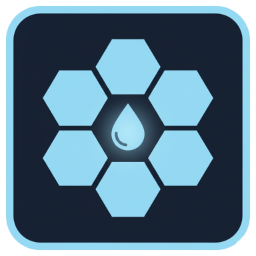
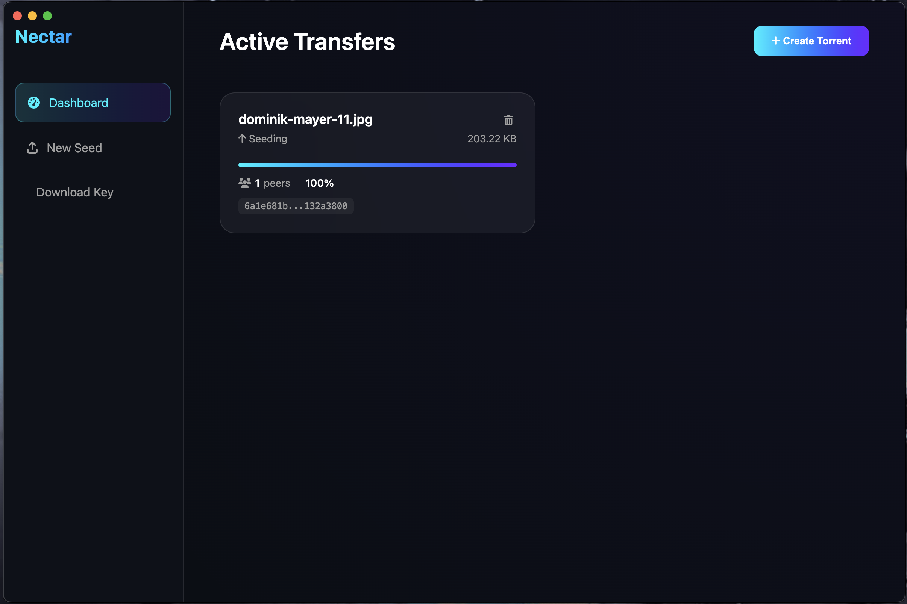
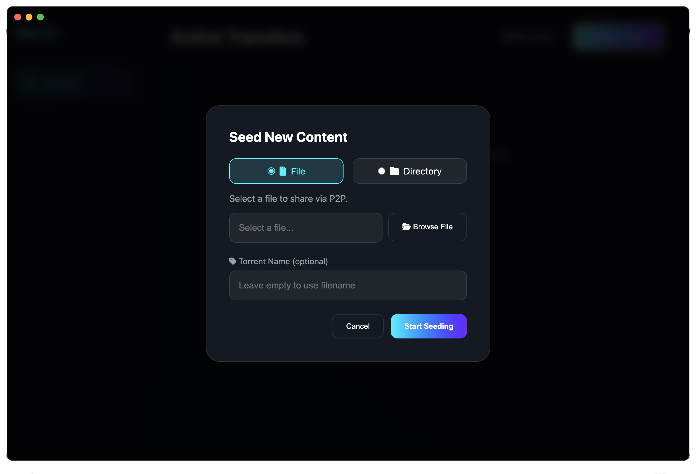
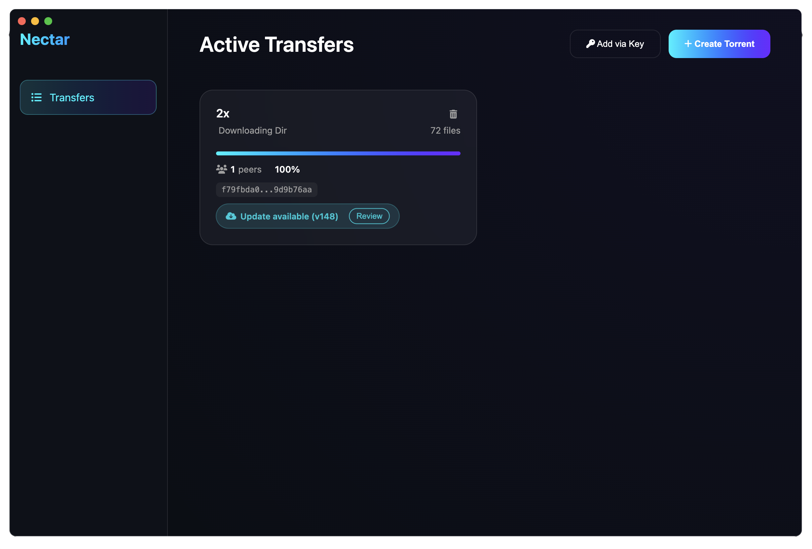
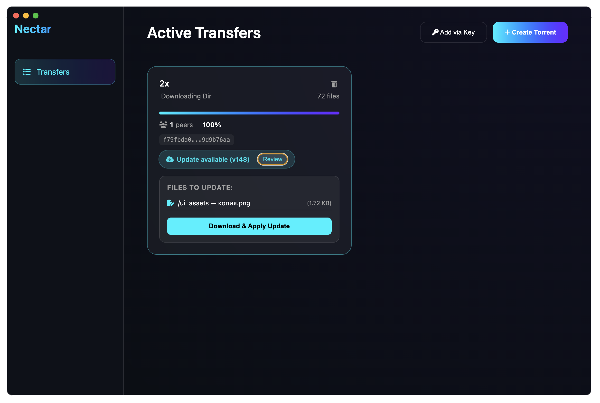

<div align="center">

# Nectar



**Nectar** is a lightweight, high-performance P2P file sharing desktop application built on the **Hypercore Protocol** stack. It allows users to seed files and download them using secure 64-character public keys, featuring a modern "glassmorphism" interface.

> [!IMPORTANT]
> **AI-Powered Prototype**: This project is a functional prototype designed and implemented entirely by an **AI Coding Assistant**. It serves as a demonstration of modern P2P technologies and rapid AI-assisted development.

---

## 📸 Screenshots

<table>
  <tr>
    <td align="center">
      <br/>
      <em>Main Dashboard</em>
    </td>
    <td align="center">
      <br/>
      <em>Seeding Files</em>
    </td>
    <td align="center">
      <br/>
      <em>Downloading</em>
    </td>
  </tr>
  <tr>
    <td align="center">
      <br/>
      <em>Update notify</em>
    </td>
    <td align="center">
      <br/>
      <em>Sync Updates</em>
    </td>
  </tr>
</table>

---

</div>

## ✨ Features

- **Decentralized Seeding** — Turn any file or directory into a P2P stream instantly
- **Isolated Sessions** — Robust `Corestore` management ensuring stability during multi-torrent operations
- **Real-time Monitoring** — Live peer count tracking via `Hyperswarm` events
- **Selective Downloads** — Choose specific files or folders to download from a torrent
- **Sync Support** — Automatic detection and download of updates from seeders
- **Native Experience** — Powered by Electron with native file and directory pickers
- **Modern UI** — Sleek, dark-mode dashboard with glassmorphism design and smooth animations
- **Toast Notifications** — Non-blocking error and success messages

---

## 🛠️ Technology Stack

Nectar is built using the following state-of-the-art technologies:

| Technology | Description |
|------------|-------------|
| **[Electron](https://www.electronjs.org/)** | Cross-platform desktop application framework |
| **[Hyperswarm](https://github.com/holepunchto/hyperswarm)** | Distributed networking stack for finding and connecting to peers |
| **[Corestore](https://github.com/holepunchto/corestore)** | Smart storage for multiple Hypercores with namespace isolation |
| **[Hyperdrive](https://github.com/holepunchto/hyperdrive)** | P2P file system built on top of Hypercore |
| **[Hyperbee](https://github.com/holepunchto/hyperbee)** | B-tree built over Hypercore for efficient metadata indexing |
| **[Express](https://expressjs.com/)** | Fast, minimalist web framework for the internal API |
| **[WebSocket](https://github.com/websockets/ws)** | Real-time bidirectional communication for UI updates |

---

## 🚀 Getting Started

### Prerequisites

- [Node.js](https://nodejs.org/) (v16 or higher)
- [npm](https://www.npmjs.com/)

### Installation

1. **Clone the repository:**
   ```bash
   git clone https://github.com/vogster/nectar.git
   cd nectar
   ```

2. **Install dependencies:**
   ```bash
   npm install
   ```

### Running the App

**Start the Electron application:**
```bash
npm start
```

## 📜 License

ISC License — Feel free to use and modify for your own honey-filled projects! 🍯

---

<div align="center">

**Built with ❤️ using the Hypercore Protocol**


</div>
